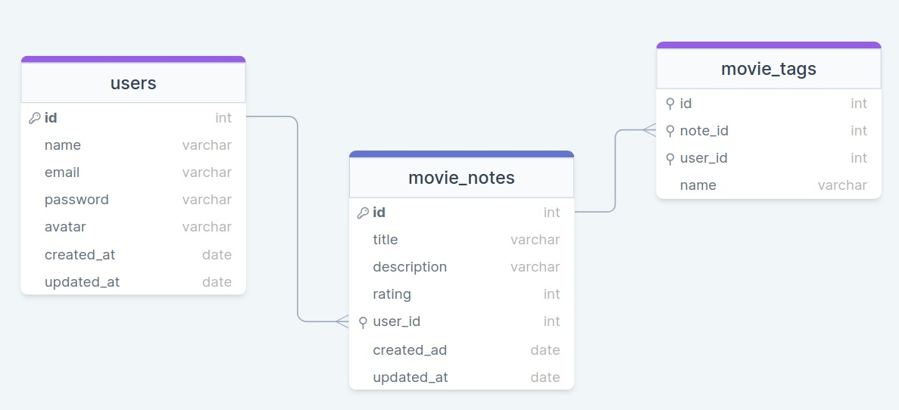

<h1 align="center"> DESAFIO NODEJS </h1>
<h2 align="center"> Cadastro de Filmes </h2>

O que foi abordado nesse desafio:

- API em nodejs
- Banco de dados -> SQLite
- Query builder -> knex
- Primary key, Foreign key
- Criptografia de senha
- Tratamento de erros -> try e catch
- Criação, atualização e exclusão de usuário
- Criação, filtragem e exclusão de notas e tags
- Inner join
- e muito mais.

  

